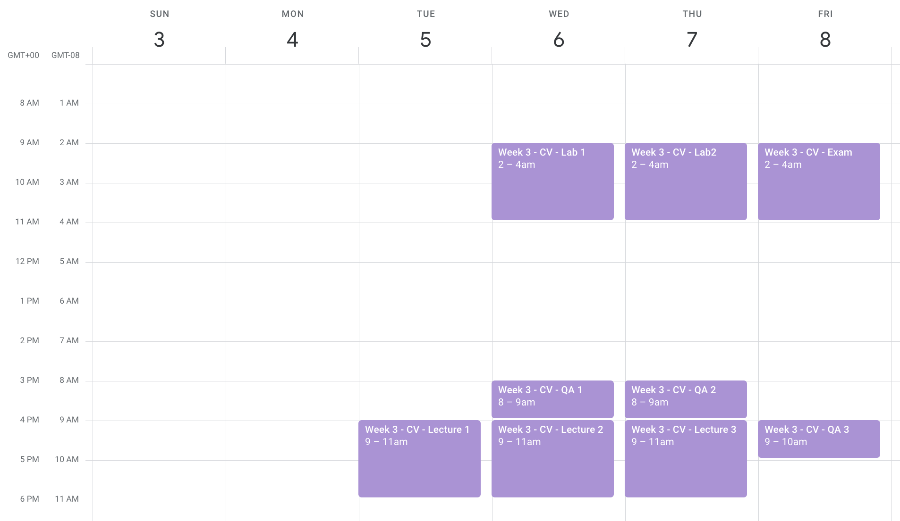

# Schedule & Logistis

### Schedule

The schedule is listed below. Note that the times listed on the calendar (purple) are in Pacific Time Zone. The corresponding time in Senegal Time Zone are listed on the far left column (under the `GMT+00` header)




### Deadlines
* The deadline for the quiz is on **April 10**. The dropbox link will close at that time and you won't be able to upload your answers after that. No uploaded answers means `0/100`! Each question in the test has equal weight, in other words each question counts for `100/#qs` where `#qs` is the number of questions in the test. 

* The deadline for the lab sessions is on **April 10**. However, I advise you to start early so that you have the chance to ask questions in our QA sessions during the week and also get assistance from the TAs. The dropblox link for the labs will be deactivated after the deadline. No uploaded reports means `0/100`! Reports will be graded with maximum score of `100`.

### Grades
Your final grade will be determined as follows: 
```
final_grade = 0.25 * grade_quiz + 0.75 * (grade_lab1 + grade_lab2) / 2.0
```
